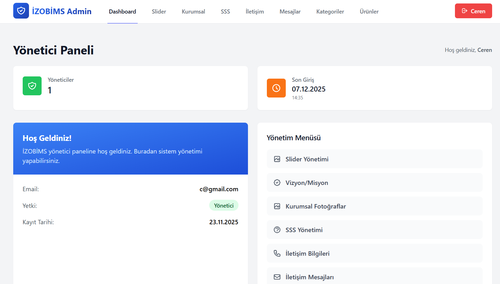
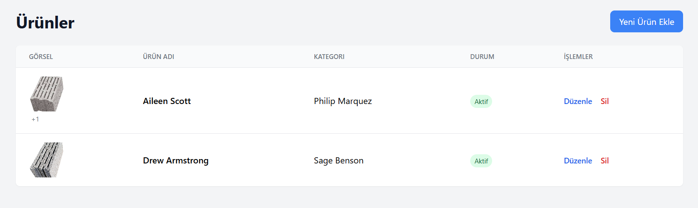
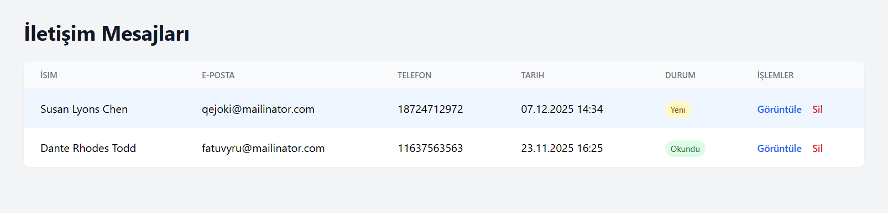

# Izobims 

Bu proje, İzobims için geliştirilmiş, dinamik içerik yönetimine sahip modern ve responsive bir kurumsal web sitesidir.
Proje, hem güçlü bir Yönetim Paneli hem de kullanıcı deneyimini yükselten animasyonlu bir frontend yapısı içerir.

### 🔗 [Canlı Demo İçin Tıklayınız](https://izobims.com/)
> *Not: Canlı site içeriği (yazılar, görseller) müşteri tarafından yönetim paneli üzerinden değiştirilmiş olabilir. Projenin orijinal tasarım kurgusu aşağıda bazı ekran görüntülerinde sunulmuştur.*

---

## 🎨 Frontend & Kullanıcı Arayüzü

Kullanıcı arayüzü, Tailwind CSS kullanılarak modern tasarım prensiplerine uygun olarak geliştirilmiştir.

**Modern & Responsive Tasarım**

  -Tailwind CSS ile tamamen responsive yapı

  -Minimal, modern ve kurumsal arayüz

**Gelişmiş CSS Animasyonları**

  -Özel @keyframes ile giriş animasyonları (fadeInUp, slideIn)

  -Arka planda hareket eden Blob efektleri

  -Glassmorphism (buzlu cam) bileşenleri

  -Kurumsal sayfada Pure CSS ile 3D Dönen Küp animasyonu

**AJAX Tabanlı Ürün Deneyimi**

  -Sayfa yenilenmeden kategori filtreleme

  -Ürün detaylarını Modal içinde AJAX ile hızlı yükleme

  -Modal içi özel resim slider sistemi

**İnteraktif Bileşenler**

  -Accordion yapısında çalışan SSS bölümü

  -Sertifika görselleri için Lightbox tarzı modal

  -Kurumsal süreç için Timeline tasarımı

---

## 📸 Yönetim Paneli (Admin Dashboard)

Site içeriğinin kod bilgisi gerekmeden tamamen yönetilebilmesini sağlayan, güvenlikli ve modüler bir panel geliştirilmiştir.

### 1. Genel Bakış ve Kontrol Merkezi
Yöneticinin sisteme giriş yaptığında karşılaştığı, özet verilerin bulunduğu dashboard ekranı.

### 2. Gelişmiş Ürün Yönetimi ve Varyasyonlar
Ürünlere **çoklu fotoğraf yükleme** (drag & drop) ve o ürüne özel dinamik **teknik özellik (spesifikasyon)** tanımlama altyapısı.

### 3. İletişim ve Mesaj İş Akışı (Workflow)
Site üzerinden gelen formların listelendiği alan. **Okundu/Yeni** durum bildirimleri (badges) ile müşteri ilişkileri kolayca yönetilebilir.

---

## 🚀 Proje Özellikleri

### 🛠 Backend (Laravel & Yönetim Paneli)
* **Dinamik İçerik Yönetimi:** Vizyon, Misyon, Slider ve Kurumsal yazı alanlarının tam kontrolü.
* **Kategori Bazlı Ürün Sistemi:** Sınırsız kategori ve ürün ekleme imkanı.
* **Medya Yönetimi:** Ürünler için sürükle-bırak mantığıyla çalışan, sıralanabilir çoklu fotoğraf yükleme sistemi.
* **Özellik (Specification) Sistemi:** Her ürün için dinamik olarak "Boyut", "Ağırlık", "Direnç" gibi teknik özellikler ve birimler eklenebilir.
* **İletişim Merkezi:** Gelen mesajların okunma durumuna göre listelenmesi, silinmesi ve arşivlenmesi.
* **SSS (FAQ) Yönetimi:** Sıkça sorulan soruların akordiyon yapısı için dinamik yönetimi.

### 🌐 Frontend (Arayüz & UX)
* **Teknoloji:** Blade Templates & Tailwind CSS.
* **Animasyonlar:** Özel `@keyframes` tanımları, `backdrop-filter` efektleri, 3D transformlar ve `blob` animasyonları.
* **Performans:** Vanilla JS ve Fetch API kullanılarak yapılan asenkron veri çekme işlemleri (Sayfa yenilemeden ürün getirme).
* **Responsive:** Mobil, tablet ve masaüstü uyumlu esnek yapı.

---
